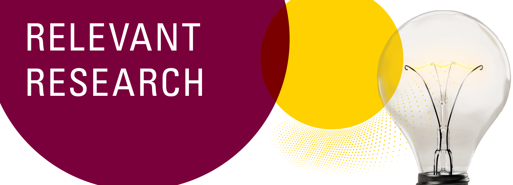

# Relevant Research Series
## Relevant Research Series workshops:
### [Transcending Mental Models](https://scds.github.io/transcending-mental-models/)
### [Telling Data-Driven Stories: Lessons from data journalism](https://scds.github.io/data-driven-stories/)
### [Design Principles for Data Visualization](https://scds.github.io/data-visualization-principles/)
### [Feminist Data Workshop](https://github.com/scds/building-feminist-data)  
--- 

The Relevant Research Series brings together leading international experts in cross-disciplinary, skill-building workshops on data storytelling, visualization and audience research. Presented in partnership between the [Sherman Centre](https://scds.ca/) and [Spark](https://spark.mcmaster.ca/). The series was generously supported by funding from the Social Sciences and Humanities Research Council of Canada. 

<!-- Edit the content below for the workshop in question. Once you're ready to publish, remove the comment characters e.g. "<!--" at the start and end -->

<!--

# Welcome to Data Visualization with Tableau. 

You might not think of numbers and locations as Humanities data, but it all depends on how you use them! Working with numeric and spatial data, you will learn how to create visualizations in [Tableau](https://www.tableau.com/).

Proceed to the [Preparation](preparation) page to get started.
-->

